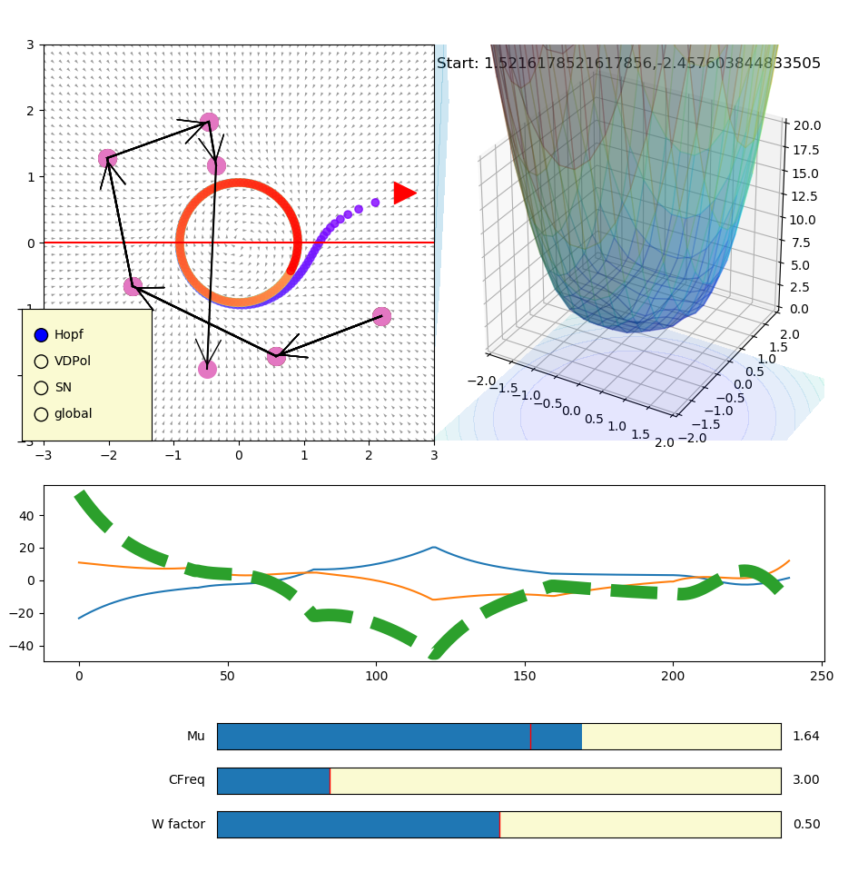

# Dynamical Network

## Overview
This is a small library to study low-dimensional dynamical systems using intuitive UI and [autoLie](https://github.com/virati/autoLie)

## Dynamical System Viewer
Right now, the most complete portion of this repo is the Dynamical System Viewer (interactive_flow_field.py). Below is a quick visual overview of what this tool does.

The viewer itself has several components - phase portrait, pseudo-energy landscape, and time series.

For an interactive notebook version of the above that can run in your browser, head to [colab](https://colab.research.google.com/drive/101JEF-nCyKaMFq1CRGgpca4oebaLh7bO?usp=sharing)

### Phase space
The top left consists of a phase-space representation of our dynamical system and an example trajectory from a given initial state.

Dynamics selection amongst a set of pre-defined systems can be done using the checkbox.

### Potential-like function
On the top right is a potential-like function that computes the gradient of a the magnitude of change.

It must be mentioned that this is not the potential function itself as such a function may not be exist for all systems. Indeed, for oscillatory systems a potential function does not exist as flows occur down a potential gradient but an oscillatory system has a periodicity in its state trajectory over time that indicates it cannot always be going down a gradient.

## Control signal
A relatively new feature is in the identification of a control system for the implementation of an arbitrary piecewise linear trajectory. Left clicking in the phase-portrait representation at various locations traces out a desired trajectory. The required control signal input to implement that trajectory is then displayed in the middle timeseries panel as a dotted green line.

This is an in-development feature of the UI but will be expanded on to enable arbitrary control-affine coupling into the dynamics of the system. In addition, the control will be abstracted into the backend library to enable integration with autoLie and broader efforts to identify optimal control strategies for simplified dynamical systems in a way that is intuitive to the visual/clinical learners.
