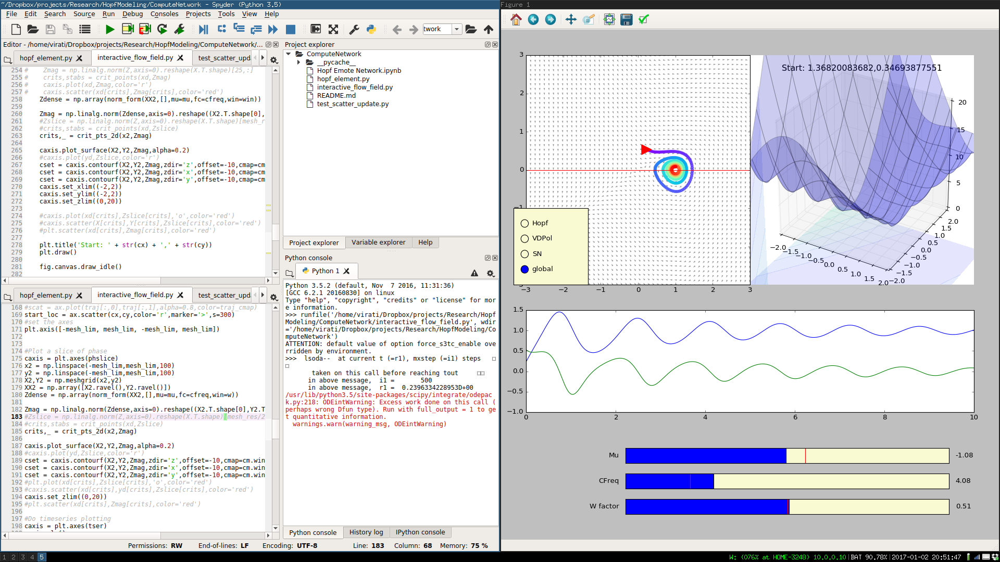

# Dynamical Network

## Overview
This project is an attempt to build a framework for studying networks of dynamical systems. The goal of this is to merge this with efforts to understand empirical electrophysiologic changes in mood disorders.

## Dynamical System Viewer
Right now, the most complete portion of this repo is the Dynamical System Viewer (interactive_flow_field.py). Below is a quick visual overview of what this tool does.

On the right half of the screen is the viewer. The top left shows the 2d phase portrait of the system, along with a trajector with a clickable starting point. The trajectory itself is color coded based on the time of the state.

The left side has a beige clickbox array that enables you to choose the dynamical system you want to explore.

The top right is a surrogate of the potential field for the dynamical system. It is computed by finding the L2 norm of the flow at every x,y coordinate and plotting that as the z (height) of the 3d mesh
The middle row is a timeseries of the two dimensions
The bottom row is a set of interactive sliders to adjust mu (the bifurcation parameter), the frequency (a uniform weight on the dynamics equations for both variables), and a context-specific 'w' factor, which is a work in progress. Right now, in the Hopf system, this factor adjusts the weight to give a convex combination of the two directions of flow, giving interesting shapes to the dynamics.
